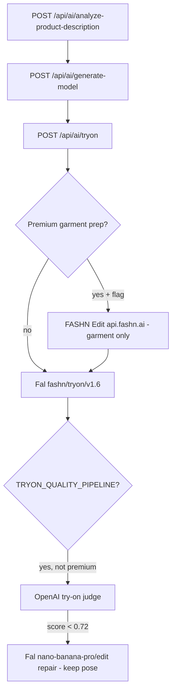

# Pose Control API Audit — Kaspi Fashion Try-On SaaS

**Date:** 2026-05-20  
**Mode:** Audit only (no code changes, no paid API calls, no `.env.local` access)  
**Sources:** Current repo (`c:\dev\kaspi`) + official FASHN docs (`docs.fashn.ai`) + Fal model page (`fal.ai/models/fal-ai/fashn/tryon/v1.6/api`) + FASHN Help Center prompting guide

---

## Executive answer

| Question | Answer |
|----------|--------|
| Can pose/camera be controlled **directly** in Try-On v1.6 / Try-On Max API? | **No.** Neither endpoint exposes `pose`, `camera_angle`, `view`, `reference_pose`, or similar fields. |
| What **does** control pose in our SaaS flow? | **`model_image`** (generated or uploaded) + optional **nano-banana-pro** prompts/edits **before** try-on. Try-On **preserves** the model’s identity, pose, and background. |
| Does Try-On Max `prompt` change body pose? | **Officially no** — prompt is for **how the garment is worn** (tuck, sleeves, open jacket), not for turning the model or moving arms. |
| Can back view work with front-only product photo? | **Only as hallucination** for back-specific details (print, lace back, closures). Honest back PDP needs a **back product image** (or flat-lay back). |
| Best flow for Kaspi marketplace | **Variant A:** pose-aware **model generation** (Fal `nano-banana-pro`) → **FASHN Try-On v1.6** via Fal (`mode: quality` for 2K). Relax try-on-safe rules **per preset tier**, not globally. |

---

## 1. Current problem

Models look **too uniform**: front-facing, arms straight down, “soldier / parade-rest” catalog stance. That is **intentional today**, not a FASHN limitation:

- `composeModelGenerationPrompt.ts` injects a **hard “Try-on safe pose”** rule for all non-jewelry categories, explicitly banning hand-on-hip, arms akimbo, hands on waist/stomach/bra, and dynamic editorial poses.
- `modelIdentityPipeline.ts` (`lingerieNeutralBaseOutfitGuidance`) repeats arms-down / hands-near-outer-thigh rules for lingerie bases.
- `modelFraming.ts` + `sourceModelPromptRules.ts` **sanitize** source product photos to **standing front-facing try-on-safe** pose when product-zone framing is active.
- UI pose enum is only `front` \| `slight-angle` \| `custom` (`components/studio/types.ts`); defaults to **`front`**.
- Rich angle copy exists in `lib/ai/modelAngles.ts` (`angle-three-quarter`, `back-view`, `front-hands-side`, etc.), but **`resolveSelectedModelAngles()` only uses `customAngles`**, not `anglePresets` — preset prompts are **not applied** unless passed via `cameraAnglePrompt` / product angle analysis.

**Product goal:** More alive marketplace angles (3/4, slight turn, back, relaxed catalog, careful hand-near-shoulder) **without** hands covering bra cups, waistband, lace, or center front panel — especially for lingerie / high-waist.

---

## 2. Current pipeline

### 2.1 End-to-end SaaS flow (`StudioShell.handleCreatePhotoOnModel`)



### 2.2 Routes and models (what we actually call)

| Step | HTTP route | Provider / model ID | Pose relevance |
|------|------------|---------------------|----------------|
| Product analysis | `POST /api/ai/analyze-product-description` | OpenAI vision | Extracts `sourceModel.pose`, `cameraAngle`, `handsPosition` |
| Optional angles | `POST /api/ai/analyze-product-angles` | OpenAI vision | `cameraPrompt` → `cameraAnglePrompt` on generate-model |
| **Model image** | `POST /api/ai/generate-model` | Fal `fal-ai/nano-banana-pro` (text) or `fal-ai/nano-banana-pro/edit` (angle follow-up) | **Only stage with real pose control** (English `prompt`; no pose enum in Fal input) |
| **Try-on** | `POST /api/ai/tryon` | Fal `fal-ai/fashn/tryon/v1.6` | **No pose fields** — uses `model_image` as-is |
| Premium garment prep | *(inline in tryon)* | FASHN `model_name: "edit"` @ `api.fashn.ai/v1/run` | Masked **garment** cleanup only; not model pose |
| Judge | *(inline)* | OpenAI `try-on-judge` | Scores garment fidelity; no pose change |
| Repair | *(inline)* | Fal `nano-banana-pro/edit` | Prompt: **“Keep the same model, face, pose and body”** |

**Not integrated today:** FASHN `tryon-max`, `model-create`, `product-to-model`, `face-to-model`, `model-swap`, `reframe` (except Edit for garment prep).

### 2.3 “Try-On Max” in our codebase vs FASHN Try-On Max

| Name in product/UI | What it really is |
|--------------------|-------------------|
| UI “Максимальное качество” / 2K | `mode: "quality"` on **Try-On v1.6** (`lib/studio/tryOnQuality.ts`) |
| FASHN **Try-On Max** (`model_name: "tryon-max"`) | **Separate** FASHN API endpoint — **not wired** in repo |

### 2.4 Model generation prompt stack

| Layer | File | Effect on pose |
|-------|------|----------------|
| GPT composer hard rules | `lib/ai/composeModelGenerationPrompt.ts` → `hardRulesFor()` | Soldier-safe arms down; bans hand-on-hip, 3/4 Vogue arms, etc. |
| Template prompt | `lib/ai/modelPrompts.ts` → `buildModelGenerationPrompt()` | `resolvePoseInstruction()`, `mandatoryFramingGuidance()`, `tryOnPoseNegatives()` |
| Lingerie neutral base | `lib/ai/modelIdentityPipeline.ts` | Standing only; arms along sides; no hand on hip/waistband |
| Source sanitization | `lib/ai/sourceModelPromptRules.ts` | Forces standing front-facing when source framing active |
| Angle edit (2nd shot) | `buildModelAngleEditPrompt()` | Changes pose via edit prompt + `cameraAnglePrompt` |
| Fal input | `lib/ai/runFalModelGeneration.ts` | Fields: `prompt`, `aspect_ratio`, `resolution`, `safety_tolerance`, `seed` — **no pose API** |

### 2.5 Try-On v1.6 request (our code → Fal)

From `lib/ai/falSchemas.ts` + `app/api/ai/tryon/route.ts`:

```ts
input: {
  model_image, garment_image, category, mode, garment_photo_type,
  moderation_level, num_samples, segmentation_free, output_format, seed?
}
```

---

## 3. What FASHN / Fal **supports** (official spec)

### 3.1 Try-On v1.6 — Fal `fal-ai/fashn/tryon/v1.6` & FASHN `tryon-v1.6`

**Supported input fields (complete list from official schema):**

| Field | Type | Default | Notes |
|-------|------|---------|-------|
| `model_image` | string (URL/base64) | **required** | Person photo — **pose comes from here** |
| `garment_image` | string | **required** | Product reference |
| `category` | `auto` \| `tops` \| `bottoms` \| `one-pieces` | `auto` | Garment type |
| `mode` | `performance` \| `balanced` \| `quality` | `balanced` | Speed vs quality (we map 2K→`quality`) |
| `garment_photo_type` | `auto` \| `model` \| `flat-lay` | `auto` | Reference type |
| `moderation_level` | `none` \| `permissive` \| `conservative` | `permissive` | `conservative` blocks underwear/swimwear |
| `seed` | integer | — | Reproducibility |
| `num_samples` | integer 1–4 | `1` | Multiple candidates |
| `segmentation_free` | boolean | `true` | Bulkier garments |
| `output_format` | `png` \| `jpeg` | `png` | |
| `return_base64` | boolean | `false` | FASHN native API only |
| `sync_mode` | boolean | — | Fal-only |

**Documented behavior:** Virtual try-on **fits garment onto existing person**; marketing copy notes the model handles varied poses when **inputs align**, but there is **no pose parameter**.

**Runtime:** `PoseError` if body pose cannot be detected in `model_image` (or garment when `garment_photo_type: "model"`).

**Credits (FASHN native):** 1 credit / image. **Processing:** ~5–17s by mode.

### 3.2 Try-On Max — FASHN `tryon-max` (not in our repo)

**Supported fields:**

| Field | Required | Purpose |
|-------|----------|---------|
| `product_image` | yes | Garment |
| `model_image` | yes | Person — docs: **“preserves the model's identity, pose, and styling”** |
| `prompt` | no | Styling: `"remove scarf"`, `"tuck in shirt"`, `"roll up sleeves"` |
| `resolution` | no | `1k` \| `2k` \| `4k` |
| `generation_mode` | no | `balanced` \| `quality` |
| `seed`, `num_images`, `output_format`, `return_base64` | no | |

**No** `pose`, `camera_angle`, `view`, `reference_pose`, `inspiration_image`, `background_image`, `face_image`, `image_context` on Try-On Max.

**Help Center — Try-On tool:** “Try-On preserves the model's identity, pose, and background automatically.” Prompt focuses on **how garment is worn**, not body rotation.

**Credits:** 2–5 per image (resolution × mode). **Time:** 20–120s.

### 3.3 Model Create — FASHN `model-create`

| Field | Purpose |
|-------|---------|
| `prompt` | **required** — model, clothing, **pose**, scene |
| `image_reference` | Optional — guides composition/pose (not exact copy); pose vs silhouette controlled via prompt NL |
| `face_reference`, `face_reference_mode` | Identity lock |
| `aspect_ratio`, `resolution`, `generation_mode`, `seed`, `num_images`, `output_format`, `return_base64` | Output controls |

**Can generate model in desired pose before try-on** — alternative to nano-banana-pro if we adopt FASHN native stack.

### 3.4 Product to Model — FASHN `product-to-model`

| Field | Purpose |
|-------|---------|
| `product_image` | **required** |
| `image_prompt` | Inspiration for **pose, environment, lighting** |
| `prompt` | Person appearance, styling, background |
| `face_reference`, `face_reference_mode` | Identity |
| `background_reference` | Scene only (person ignored) |
| `aspect_ratio`, `resolution`, `generation_mode`, … | |
| `model_image` | **Deprecated** — use Try-On Max to combine product + existing person |

**Generates a new person wearing the product** — different product architecture (one-shot PDP without separate base model step).

### 3.5 Face to Model — `face-to-model`

`face_image` + optional `prompt` (body shape). Upper-body avatar for try-on. **No dedicated pose enum**; limited to vertical aspect ratios.

### 3.6 Edit — FASHN `edit` (we use for premium **garment** prep)

| Field | Purpose |
|-------|---------|
| `image` | Source |
| `prompt` | **Freeform** — docs explicitly include **pose or view adjustments** |
| `mask` | Region hint |
| `image_context` | Visual reference for complex pose/background |

**Preserves identity and product fidelity** while editing — usable for **post-try-on** angle tweaks but **risky** for garment edges (see Variant D).

### 3.7 Reframe — `reframe`

`image` + `aspect_ratio` only — **crop/outpaint**, **not** body rotation or hand placement.

### 3.8 Model Swap — `model-swap`

Identity change; Help Center: can change pose/background but **best as “who” change**; pose control → use Edit afterward.

### 3.9 Moderation (try-on)

| Level | Effect |
|-------|--------|
| `permissive` | Allows underwear/swimwear; blocks explicit nudity (our default) |
| `conservative` | Blocks underwear, swimwear, revealing outfits |
| `none` | No moderation (ToS responsibility) |

---

## 4. What FASHN / Fal **does NOT** support

| Capability | Try-On v1.6 | Try-On Max | Our repair (nano edit) |
|------------|-------------|------------|-------------------------|
| API field `pose` / `camera_angle` / `view` | ❌ | ❌ | N/A (prompt only) |
| Prompt to rotate body 90° / full side profile | ❌ | ❌ (garment styling only) | ⚠️ repair **forbidden** to change pose |
| Guaranteed back print from front-only SKU | ❌ | ❌ | ❌ |
| Hands-on-hips without covering torso | ❌ API-level | ❌ | Must be in `model_image` |
| Seated pose safe for high-waist brief fit | ❌ API-level | ❌ | Conflicts with our lingerie rules |
| `reference_pose` / `inspiration_image` on try-on | ❌ | ❌ | — |

**Blog/marketing** mentions 3/4 and back poses for v1.6 — that refers to **compatible input photos**, not programmatic pose control.

---

## 5. Logic Q&A (try-on behavior)

| Question | Conclusion |
|----------|------------|
| Does Try-On **keep** pose from `model_image`? | **Yes** — official Try-On Max wording applies to the family: identity + **pose** preserved. v1.6 has no pose override. |
| If `model_image` is 3/4, will try-on keep it? | **Generally yes**, if body is detectable and garment alignment is reasonable; quality depends on angle match and `garment_photo_type`. |
| Back-view `model_image` + front flat-lay garment? | Try-on will **warp front garment** onto back-facing body — **back design will be invented** unless `garment_image` includes back. |
| Front-only product → honest back PDP? | **No** — require **back product image** or accept hallucination + legal/merchant risk. |
| Should we require back SKU photo for “Спина” preset? | **Yes** for bras, lace backs, logos, adjustable straps; optional for symmetric plain tops. |

---

## 6. Why “soldier pose” today (root cause map)

| Cause | Location | Mechanism |
|-------|----------|-----------|
| Hard try-on-safe rule | `composeModelGenerationPrompt.ts:149-151` | Explicit ban on hand-on-hip, akimbo, hands on garment zones |
| Template negatives | `modelPrompts.ts` → `tryOnPoseNegatives()` | Appended to “Do not generate: …” |
| Lingerie base outfit block | `modelIdentityPipeline.ts:80-88` | Arms down, shoulders square, no hand on hip |
| Source photo sanitization | `sourceModelPromptRules.ts` | Standing front-facing wins over source pose |
| Minimal UI poses | `types.ts` `ModelPose` | Only `front` / `slight-angle` |
| Angle presets not wired | `modelAngles.ts` `resolveSelectedModelAngles()` | Preset English prompts unused unless custom/analysis path |
| Repair locks pose | `productAnalysisPipeline.ts` | Post-try-on cannot fix boring pose |

**Can we add pose presets without breaking try-on?** **Yes, if tiered:** keep strict rules for lingerie/high-waist; allow controlled 3/4 and “soft hands on outer hips” for clothing; wire prompts through `cameraAnglePrompt` + relaxed `hardRulesFor(posePreset)` — **requires code change** (out of scope for this audit).

---

## 7. Architecture options (A–D)

| Variant | Flow | Pose control | Garment fidelity | Cost (rel.) | Speed | Implementation | Risk |
|---------|------|--------------|------------------|-------------|-------|----------------|------|
| **A** | Pose-aware **model gen** → **Try-On v1.6** | **High** (prompt) | **High** (proven path) | 1× gen + 1× try-on | Fast try-on | **Low** — extend existing | Low if presets tiered |
| **B** | Model gen → **Try-On Max** + prompt | **Low** for pose | High | Higher (2–5 cr) | Slower | New endpoint + dual stack | Prompt won’t fix soldier pose |
| **C** | **Product to Model** / **Model Create** | **High** (prompt + `image_prompt`) | Medium — new person each time | 1–5+ cr | Slow | **High** — new pipeline | Identity consistency harder |
| **D** | Try-on → **Edit/Reframe** | Medium (Edit) / none (Reframe) | **Medium–Low** — lace/waist edges | +1–5 cr | Slow | Medium | Edit may smear garment; repair forbids pose fix |

**Best for Kaspi SaaS:** **Variant A** as MVP; optionally pilot **FASHN Model Create** later for preset gallery; **do not** expect Try-On Max prompt for pose; **Reframe** only for marketplace aspect ratios, not liveliness.

---

## 8. Recommended MVP implementation

### 8.1 Product UI (pose presets)

| UI label (RU) | ID | Tier | Notes |
|---------------|-----|------|-------|
| Авто | `auto` | Safe | Current behavior + best-effort 3/4 only if product analysis suggests |
| Фронт | `front-catalog` | Safe | Explicit front, weight shift OK |
| Лёгкий 3/4 | `three-quarter-soft` | Standard | 25–35° turn, arms safe |
| Руки на бёдрах (безопасные) | `hands-outer-hips` | Standard | **Not** classic hand-on-hip — palms on **outer hip bones**, elbows back |
| Рука у плеча / бретели | `hand-near-shoulder-safe` | Restricted | Lingerie: finger **behind** strap line, never over cup |
| Спина | `back-view` | Restricted | Requires back SKU or symmetric garment warning |
| Каталог relaxed | `relaxed-catalog` | Safe | Subtle asymmetry, one hand outer thigh |
| Сидя | `seated-catalog` | **Blocked** for lingerie/high-waist | Clothing only + warning |

### 8.2 Engineering steps (future, not done in this audit)

1. Add `posePreset` to generate-model request + map to `cameraAnglePrompt` English block.
2. Replace monolithic `hardRulesFor()` with **`getPoseRules(preset, categoryContext)`** — strict default for lingerie.
3. Fix `resolveSelectedModelAngles()` to expand `anglePresets` OR merge preset `prompt` into `cameraAnglePrompt`.
4. Product UX: if preset = `back-view` and analysis has no `back` photo → prompt upload back image.
5. Paid validation matrix (see §10).

### 8.3 What **not** to do in MVP

- Switch to Try-On Max **only** for livelier poses.
- Run FASHN Edit on **try-on result** to rotate body (garment damage on lace/high-waist).
- Enable `seated-lifestyle` from `modelAngles.ts` for lingerie without rule override.

---

## 9. Pose preset table

| Preset ID | EN prompt (core) | Negative prompt (append to “Do not generate”) | OK categories | Avoid / block | Back product image? | Lingerie / high-waist risk |
|-----------|------------------|-----------------------------------------------|---------------|---------------|---------------------|----------------------------|
| `auto` | *(inherit current safe stack)* | *(current `tryOnPoseNegatives`)* | All | — | As today | Low |
| `front-catalog` | `Front-facing ecommerce catalog pose, shoulders square to camera, subtle weight on one leg, arms relaxed straight along outer sides of body, hands near outer thighs below garment zone, calm confident expression, full garment area unobstructed` | `hand on hip, arms akimbo, crossed arms, hands in front of stomach, raised arms` | All | — | No | Low |
| `three-quarter-soft` | `Soft three-quarter catalog pose, body turned 25-35 degrees toward camera, both shoulders still readable, chin slightly toward camera, arms relaxed along outer sides with hands below shoulder line and away from bust waist and hip garment zones, premium Kaspi marketplace fashion lighting` | `profile view 90 degrees, extreme twist, hand across torso, hand on waistband, Vogue dynamic pose` | clothing, general; lingerie **with strict negatives** | jewelry N/A for FASHN | No | **Medium** — watch cup edge intersection |
| `hands-outer-hips` | `Relaxed catalog stance, both hands resting lightly on outer hip bones only with elbows pointing backward and slightly behind the body, forearms not crossing the abdomen waist or bra zone, shoulders relaxed, front or soft three-quarter view` | `classic hand-on-hip pose, hands on stomach, hands on waistband, fingers over lace, crossed arms` | clothing, general | **lingerie**, high-waist, lace sets | No | **High** for lingerie — default **off** |
| `hand-near-shoulder-safe` | `Standing catalog pose, one hand lightly touching the shoulder or strap area from the side with fingers behind the strap line, other arm relaxed along outer thigh, do not cover bra cups waistband or center front panel` | `hand over bust, hand covering strap, fingers on cup, arm across chest` | tops, bra sets (careful) | bottoms-only, high-waist briefs | No | **High** — hidden experiment only |
| `back-view` | `Back-facing or back three-quarter catalog pose, natural spine alignment, arms relaxed along sides with hands below shoulder line, hair styled away from garment back, show full back of outfit` | `front-facing only, cropped head, arms crossed behind back covering garment` | tops, dresses, one-pieces | asymmetric front-only graphics | **Yes** when back detail matters | Medium — hallucinated back print |
| `relaxed-catalog` | `Relaxed asymmetric ecommerce pose, gentle weight shift, one knee soft, arms naturally down with optional light touch on outer thigh only, approachable catalog energy, garment fully visible` | `editorial runway, raised arms, sitting, leaning forward hiding waist` | clothing, general | high-waist, lace lingerie | No | Low–medium |
| `seated-catalog` | `Seated on minimal studio block, knees angled, torso facing camera, hands on thighs or beside hips never covering waist or garment front` | `squatting, crossed legs hiding brief, hands on lap covering garment` | clothing, general | **lingerie**, high-waist, swim | No | **High** — **block** for lingerie |

---

## 10. Prompt examples (copy-ready EN)

### 10.1 `three-quarter-soft` (lingerie-safe variant)

**Prompt:**

> Soft three-quarter standing studio pose, body turned 30 degrees, full head and face visible, arms hanging straight along the outer sides of the body, hands near outer thighs only, hands not in front of abdomen waist hips bra band or straps, neutral seamless base underwear unchanged, premium catalog lighting, entire bra and brief region unobstructed.

**Negative:**

> hand on hip, arms akimbo, crossed arms, hand on stomach, hand on waistband, fingers on bra cup, raised arms, seated pose, cropped head.

### 10.2 `back-view` (with merchant back photo)

**Prompt:**

> Back three-quarter catalog view, model facing away from camera with slight head turn, arms relaxed along sides, hands below shoulder line, hair tied or swept to one side exposing full garment back, natural spine curve.

**Negative:**

> front-facing, arms crossed behind back, hands covering shoulder blades or back closure, invented logos on back.

**Product:** upload **`garment_image` = back photo** (or dedicated back try-on run).

### 10.3 `hands-outer-hips` (clothing only)

**Prompt:**

> Front-facing relaxed catalog pose, both palms resting on outer hip bones only, elbows behind the body line, forearms clear of shirt front and belt area, shoulders level, commercial Kaspi style.

**Negative:**

> hands on stomach, hands crossing shirt front, thumb tucked into waistband, arms akimbo.

---

## 11. Risks — lingerie / high-waist

| Risk | Mitigation |
|------|------------|
| Hands cover bra cups / center panel | Keep **Tier S** rules for lingerie; disable `hands-outer-hips` and `hand-near-shoulder-safe` |
| Hand on waistband distorts high-waist silhouette | FASHN copies base waist from `model_image` — never prompt hand on waistband |
| 3/4 angle intersects lace edges | Limit rotation to ≤35°; enforce “arms along outer sides” |
| Seated pose → boyshort/base distortion | `lingerieModelPoseGuidance()` already forbids — keep seated **blocked** |
| Back view without back SKU | UI warning + optional second `garment_image` |
| `moderation_level: conservative` | Blocks category entirely — keep `permissive` for lingerie SaaS |
| Premium garment Edit | Does not fix pose — only prep garment |
| Judge/repair | Repair **preserves** pose — cannot recover from wrong base pose |

---

## 12. What requires paid validation

No calls were made in this audit. Before GA, run a **small matrix** (mock off, guard on):

| # | Case | Model preset | Garment | Pass criteria |
|---|------|--------------|---------|---------------|
| 1 | High-waist brief | `front-catalog` | flat-lay front | Waistband sharp, no hand artifacts |
| 2 | Bra+brief set | `three-quarter-soft` | flat-lay | Cups unobstructed, no arm-lace merge |
| 3 | Lace bra | `relaxed-catalog` | on-model | Straps visible, no finger-on-cup |
| 4 | Back closure bra | `back-view` | **back photo** | Closure aligned, not hallucinated |
| 5 | Back closure bra | `back-view` | **front only** | Document failure mode for UX warning |
| 6 | T-shirt | `hands-outer-hips` | flat-lay | Natural pose, print intact |
| 7 | Same as 6 | Try-On Max + prompt “tuck shirt” | — | Confirm **pose unchanged** vs v1.6 |
| 8 | 3/4 model | `three-quarter-soft` gen → v1.6 | flat-lay | Pose retained after try-on |
| 9 | Optional | FASHN `model-create` same preset | → v1.6 | Compare identity lock vs nano-banana |

Record: `PoseError` rate, judge score, manual “hands over garment” binary flag.

---

## 13. Final recommendation

| Decision | Recommendation |
|----------|----------------|
| **Implement pose presets?** | **Yes — phased MVP (Variant A)** |
| **Default rollout** | **Visible:** `auto`, `front-catalog`, `three-quarter-soft`, `relaxed-catalog` for **clothing** |
| **Hidden experiment** | `hands-outer-hips`, `hand-near-shoulder-safe`, `back-view` (with back-photo gate) |
| **Do not implement (yet)** | Try-On Max for pose; seated for lingerie; global removal of try-on-safe rules |
| **Do not implement** | Product-to-Model as default replacement (high architecture cost) |
| **Code prerequisite** | Relax **preset-scoped** rules in `hardRulesFor` / lingerie blocks; wire `modelAngles` presets to `cameraAnglePrompt` |

**Summary:** Pose control is **only via `model_image` (+ generation/edit prompts)**, not Try-On API fields. Our soldier pose is **self-imposed** for try-on safety. Livelier Kaspi angles are achievable by **tiered pose presets at model generation**, keeping FASHN Try-On v1.6, and requiring **back garment photos** for honest back views.

---

## Appendix A — Official API field checklist (quick reference)

**Try-On v1.6 (Fal):** `model_image`, `garment_image`, `category`, `mode`, `garment_photo_type`, `moderation_level`, `seed`, `num_samples`, `segmentation_free`, `output_format` (+ Fal `sync_mode`)

**Try-On Max:** `product_image`, `model_image`, `prompt`, `resolution`, `generation_mode`, `seed`, `num_images`, `output_format`, `return_base64`

**Model Create:** `prompt`, `image_reference`, `face_reference`, `face_reference_mode`, `aspect_ratio`, `resolution`, `generation_mode`, `seed`, `num_images`, `output_format`, `return_base64`

**Product to Model:** `product_image`, `image_prompt`, `prompt`, `face_reference`, `face_reference_mode`, `background_reference`, `aspect_ratio`, `resolution`, `generation_mode`, `seed`, `num_images`, `output_format`, `return_base64`, (`model_image` deprecated)

**Edit:** `image`, `prompt`, `mask`, `image_context`, `resolution`, `generation_mode`, `seed`, `num_images`, `output_format`, `return_base64`

**Reframe:** `image`, `aspect_ratio`, `resolution`, `generation_mode`, `num_images`, `seed`, `output_format`, `return_base64`

**Face to Model:** `face_image`, `prompt`, `aspect_ratio`, `resolution`, `generation_mode`, `seed`, `num_images`, `output_format`, `return_base64`

---

## Appendix B — Key repo references

| Topic | Path |
|-------|------|
| Try-on route | `app/api/ai/tryon/route.ts` |
| Try-on schema | `lib/ai/falSchemas.ts` |
| Model generation | `app/api/ai/generate-model/route.ts` |
| Hard pose rules | `lib/ai/composeModelGenerationPrompt.ts` |
| Angle presets (unused in resolver) | `lib/ai/modelAngles.ts` |
| Pose phrase | `lib/ai/modelFraming.ts` |
| Source sanitization | `lib/ai/sourceModelPromptRules.ts` |
| Fal model IDs | `lib/ai/falClient.ts` |
| Quality = v1.6 mode | `lib/studio/tryOnQuality.ts` |
| Repair keeps pose | `lib/ai/productAnalysisPipeline.ts` |

**External docs consulted:**

- https://fal.ai/models/fal-ai/fashn/tryon/v1.6/api  
- https://docs.fashn.ai/api-reference/tryon-v1-6  
- https://docs.fashn.ai/api-reference/tryon-max  
- https://docs.fashn.ai/api-reference/model-create  
- https://docs.fashn.ai/api-reference/product-to-model  
- https://docs.fashn.ai/api-reference/edit  
- https://docs.fashn.ai/api-reference/reframe  
- https://help.fashn.ai/using-fashn/guides/prompting-in-fashn/tool-specific-tips  
