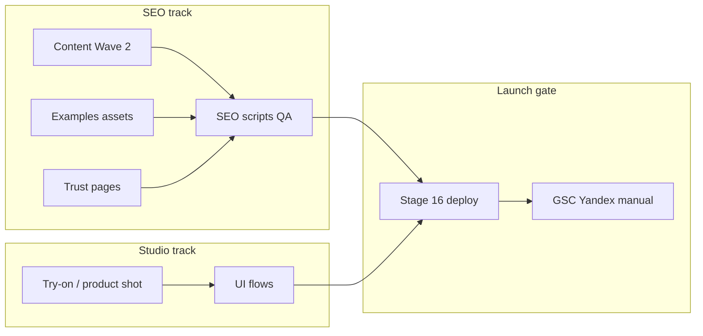

# Vitrina AI — Stage 9 SEO Growth Backlog Audit

**Date:** 2026-05-20  
**Mode:** Audit only — no code, content, OpenAI, deploy, commit, or webmaster submit  
**Strategy:** Prepare SEO/marketing in parallel with Studio; **defer production launch** until final launch gate

---

## 1. Executive summary

| Area | Status |
|------|--------|
| Local SEO (Stages 1–7) | **Ready** at `NEXT_PUBLIC_SITE_URL=https://vitrina.help` (163 sitemap URLs, hreflang, checks PASS) |
| Live production | **Not ready** (Stage 8/8.1) — owner chose **no deploy now** |
| Content published | 20 RU + 20 EN + 10 KK blogs; **80 topics** remain |
| Biggest gaps | Examples/galleries, trust pages, Wave 2 blogs (20), commercial LP depth |
| Programmatic risk | **Controlled** if only ru/en/kk index; do not open 18 locales × 100 topics |
| Parallel work | **Split branches/commits**: SEO vs Studio/AI |

**Recommendation:** Execute **Option A** (finish RU/EN + approved KK) + Wave 2 content plan + examples/trust pages **without deploy**. Target **Stage 16 Final Launch Gate** for go-live + manual GSC/Yandex.

---

## 2. Current SEO readiness (without deploy)

What is already true in the working tree (verified Stages 7–8 locally):

- `indexableLocales`: ru, en, kk (approved only)
- Sitemap policy: 163 URLs, no uz/ky/tg/global, no studio, no kk video LP
- Hreflang: 20 ru/en pairs + 10 kk triads
- Content QA scripts: ru/en/kk/content PASS
- Icons/OG/manifest exist in repo (live 404 until redeploy)

What is intentionally **paused**:

- Production env on hosting
- Cloudflare robots fix
- GSC / Yandex / IndexNow

---

## 3. Dirty tree separation

From `git status --short` (snapshot 2026-05-20).

### A — SEO Stages 1–8 (safe together)

`app/robots.ts`, `app/sitemap.ts`, `app/manifest.ts`, `app/icon.png`, `app/apple-icon.png`, `app/[locale]/**`, `components/i18n/**`, `components/landing/Saas*.tsx` (if SEO-only diffs), `data/seo/**`, `lib/seo/**`, `lib/i18n/localeConfig.ts`, `switchLocalePath.ts`, `lib/blog/blogResolve.ts`, `scripts/seo/**`, `public/og/**`, `public/icon-*.png`, `.env.example`, `package.json` (SEO scripts), `reports/seo/**`

### B — Studio / AI (exclude from SEO commit)

`components/studio/**`, `lib/ai/**`, `app/api/ai/**`, `lib/studio/**`, `reports/ai/**`, `scripts/diagnose-fal-*`

### C — Auth / billing / Supabase

Not heavily dirty in current snapshot; treat `components/auth/**`, Supabase env, Lemon paths as **never mix** with SEO-only PR.

### D — Unrelated / noise

`.next/**` build cache (never commit)

### Parallel development rules

| Rule | Why |
|------|-----|
| Branch or path-prefix commits | Avoid SEO launch bundled with try-on experiments |
| `git add` by directory | `data/seo`, `scripts/seo`, `lib/seo` vs `components/studio` |
| No SEO policy edits in Studio PRs | Prevents accidental index of draft locales |
| Re-run `smoke:seo:prelaunch` only on SEO merges | Studio changes should not block content scripts |
| Final deploy = SEO commit + Studio commit **or** one merge after both gates PASS | Owner choice at launch |

**Risks before final deploy:** wrong `NEXT_PUBLIC_SITE_URL`, mixed commit reverting kk policy, Cloudflare `Disallow: /`, publishing thin platform blogs.

---

## 4. Remaining content backlog (80 topics)

| Bucket | Count |
|--------|------:|
| Wave 2 (proposed next) | 20 |
| P1 later | 28 |
| P2 defer | 24 |
| DROP / merge | 8 |

Deliverables:

- `vitrina-ai-stage-9-content-backlog-audit-2026-05-20.csv` — all 80 rows
- `vitrina-ai-stage-9-content-backlog-plan-2026-05-20.md` — Wave 2 table + cluster notes

---

## 5. Recommended Content Wave 2

**20 RU + 20 EN** (then **5–8 KK** for Kaspi/trust topics only).

Themes: marketplace trust (#6–7, #9–10), clothing workflow (#19–20), bags (#29), eBay/Amazon/Etsy (#34–36), Instagram (#49), B2B workflow (#55), comparisons (#60–61, #75, #77), cleanup (#67), prompts (#94, #96), QA (#63).

See backlog plan MD for full table (titles, keywords, FAQ/HowTo flags).

**Not in Wave 2:** thin SKU posts (#13–15), OLX/FB (#40–41), format micro-guides (#44–46, #81–83).

---

## 6. Commercial landing page gaps

18 priority clusters audited → `vitrina-ai-stage-9-landing-page-audit-2026-05-20.csv`.

**Top P0 actions (content/design, no new routes required initially):**

1. Add **examples** blocks to AI studio + marketplace + fashion LPs  
2. Kaspi platform LP — native kk snippet (Stage 11)  
3. Keep **video LP noindex** until product ships  
4. Consolidate “virtual try-on” messaging into clothing use-case + blog #12  

**Thin but acceptable:** platform LPs (~300–400 words) if supporting blogs carry depth (WB/Ozon/Kaspi).

---

## 7. Examples / gallery plan (not built in Stage 9)

**Current state:** No `/examples` hub; no before/after component on marketing pages; Studio output not showcased on SEO pages (correct — don’t leak Studio into crawl without assets).

**Proposed structure (Stage 10–12, noindex until assets ready):**

| Page | Purpose |
|------|---------|
| `/ru/examples` | Hub |
| `/ru/examples/product-photos` | White bg / card |
| `/ru/examples/clothing-on-model` | Try-on |
| `/ru/examples/background-removal` | Before/after |
| `/ru/examples/kaspi-product-cards` | Kaspi-safe samples |
| `/ru/examples/lingerie-on-ai-model` | Adult-safe + disclaimer |

EN mirrors; KK only for Kaspi + clothing when kk copy exists.

**Requirements before index:** licensed/owned images, AI disclaimer, no fake marketplace badges, link to quality page.

---

## 8. Trust / conversion pages plan

| Page | Exists? | Proposal |
|------|---------|----------|
| How it works | Partial (landing sections) | `/ru/how-it-works` hub — Stage 10 |
| Quality & AI limits | Scattered in blogs | `/ru/quality` — Stage 10 |
| FAQ hub | Per-page FAQ only | `/ru/faq` aggregate — Stage 10 |
| For marketplace sellers | Partial | `/ru/for-marketplace-sellers` — Stage 11 |
| AI vs photo studio | Blog #74 only | `/ru/compare/ai-vs-photo-studio` — Stage 11 |
| Pricing | `/ru/cost` ✅ | Expand when billing live |
| Legal | privacy/terms ✅ | needs_review — keep noindex until legal review |
| Lingerie policy | In blog #16 | Surface on quality + acceptable-use |

**Conversion:** CTA “Открыть студию” → `/studio` (link only; no Studio flow changes in SEO stages).

---

## 9. i18n roadmap

**Recommended: Option A** — complete RU/EN + approved KK; **do not** open uz/ky/tg/global index.

CSV: `vitrina-ai-stage-9-i18n-roadmap-2026-05-20.csv`

| Locale | Next stage | Index |
|--------|------------|-------|
| ru, en | Wave 2 + trust pages | index |
| kk | +5–8 articles after Wave 2 QA | index approved only |
| uz | Optional 5–10 foundation | **noindex** until Stage 14+ |
| ky, tg | Defer | noindex |
| global | Defer | noindex |

---

## 10. Programmatic SEO risk

| Risk | Mitigation |
|------|------------|
| 100 topics × 20 locales = 2000 URLs | Cap index at **~300–400** first year |
| Platform blog duplicates platform LP | Max 1 blog per platform; rest link to LP |
| Clothing SKU articles (#13–15) | DROP — one hub |
| Machine-translated locales | Never index (current policy ✅) |
| Launch index budget | **~163 now** → **~220 after Wave 2** → **~280 after examples/trust** |
| Month 1 after launch | +20–40 URLs/month max with QA |
| Merge rule | If 2 articles share >60% intent, merge before publish |

**QA gate (keep):** `shouldIndexPage`, `published` status, word count scripts, human review.

---

## 11. OpenAI future usage plan (not executed)

**Env (from `.env.example`):**

- `OPENAI_SEO_MODEL` (e.g. `gpt-4o-mini`)
- `OPENAI_TRANSLATION_MODEL` (same or dedicated)
- `OPENAI_SEO_DRY_RUN=true` first
- `OPENAI_SEO_DAILY_BUDGET_USD` (suggest 5–15 for Wave 2)
- `OPENAI_SEO_MAX_TOKENS_PER_ARTICLE` (~3500)

**Workflow:**

1. Dry-run outline + cost estimate per article  
2. Generate RU draft → `reports/seo/drafts/`  
3. Human edit + fact check (Studio capabilities)  
4. EN translation pass (semantic)  
5. KK only for approved list (human + glossary)  
6. `check:seo:*` before status `published`  
7. **No auto-publish**

**Rough cost (Wave 2, 20 RU + 20 EN):**

| Step | Tokens (order of magnitude) | Est. USD @ mini |
|------|----------------------------|-----------------|
| RU draft 20 × ~3k out | ~60k out + 40k in | $0.15–0.40 |
| EN translate 20 × ~2.5k | ~50k out | $0.10–0.30 |
| KK 8 × ~3k | ~24k out | $0.05–0.15 |
| **Total dry-run + one pass** | | **~$0.50–1.50** (well under $5 budget) |

Do **not** use `gpt-5.5` / vision for SEO prose.

---

## 12. Parallel development strategy with Studio

- **Weekly:** SEO PR merges to `main` or `seo/*` without Studio paths  
- **Studio:** continues on same branch only if owner accepts merge risk  
- **Screenshots for examples:** export from Studio when feature stable — store under `public/examples/` (future)  
- **No SEO copy claiming unreleased Studio features** — sync with product changelog

---

## 13. Proposed Stage 10–15 roadmap

| Stage | Focus | Deploy? |
|-------|--------|---------|
| **10** | Trust pages (how-it-works, quality, faq) + examples hub scaffold (noindex ok) | No |
| **11** | Content Wave 2 RU (+ EN), commercial LP enhancements | No |
| **12** | Examples/gallery assets + before/after components on LPs | No |
| **13** | KK Wave 2 subset (5–8) + kk platform copy | No |
| **14** | UZ foundation 5–10 pages (noindex) — optional | No |
| **15** | SEO-only commit hygiene + full prelaunch regression | No |
| **16** | **Final launch gate** — hosting env, redeploy, live verify, owner GSC/Yandex | **Yes (approval)** |

---

## 14. Pre-launch “do not forget” checklist

- [ ] `NEXT_PUBLIC_SITE_URL=https://vitrina.help` on hosting  
- [ ] Redeploy Stages 1–7+ tree (SEO-only commit clean)  
- [ ] Cloudflare: remove `Disallow: /`; purge robots/sitemap/assets cache  
- [ ] Live robots + sitemap (~163 → post-Wave 2 ~220)  
- [ ] Live canonical/hreflang on vitrina.help  
- [ ] `/kk/onim-video-generator` noindex; uz/ky/tg/global noindex  
- [ ] icon/manifest/OG 200  
- [ ] GSC + Yandex verify + **manual** sitemap  
- [ ] IndexNow only with approval  
- [ ] Analytics IDs if used  
- [ ] CTA `/studio` works (smoke link only)  
- [ ] Rollback: `indexableLocales`, kk policy, env  
- [ ] Studio/AI final build gate separate from SEO gate  

---

## 15. What NOT to do (Stage 9)

- Deploy production now  
- Submit sitemap / IndexNow  
- Generate articles or call OpenAI  
- Open uz/ky/tg/global index  
- Change robots/sitemap/hreflang policy without report  
- Mix Studio commits into SEO-only release  
- Read/log `.env.local` secrets  

---

## 16. Final recommendation

| Question | Answer |
|----------|--------|
| Launch now? | **No** (owner decision aligned with Stage 8) |
| Continue SEO work offline? | **Yes** — Wave 2 + examples + trust pages |
| Next priority | P0 commercial LP examples + Wave 2 trust/marketplace articles |
| i18n | Option A — RU/EN/KK only indexed |
| Ready to submit sitemap? | **No** until Stage 16 live verification |

---

## Deliverables (Stage 9)

| File | Purpose |
|------|---------|
| `vitrina-ai-stage-9-growth-backlog-audit-2026-05-20.md` | This report |
| `vitrina-ai-stage-9-content-backlog-audit-2026-05-20.csv` | 80 remaining topics |
| `vitrina-ai-stage-9-content-backlog-plan-2026-05-20.md` | Wave 2 proposal |
| `vitrina-ai-stage-9-landing-page-audit-2026-05-20.csv` | 18 clusters |
| `vitrina-ai-stage-9-i18n-roadmap-2026-05-20.csv` | Locale strategy |

---

## Acceptance criteria

| # | Criterion | Met |
|---|-----------|-----|
| 1 | No code changes | Yes |
| 2 | No content generated | Yes |
| 3 | No OpenAI | Yes |
| 4 | No commit/push/deploy | Yes |
| 5 | Studio/AI/auth untouched | Yes |
| 6 | Full backlog | Yes (CSV) |
| 7 | Wave 2 proposal | Yes |
| 8 | Landing gap audit | Yes |
| 9 | Examples plan | Yes |
| 10 | Trust pages plan | Yes |
| 11 | i18n roadmap | Yes |
| 12 | Programmatic risk | Yes |
| 13 | OpenAI plan | Yes |
| 14 | Parallel strategy | Yes |
| 15 | Stage 10–15 roadmap | Yes |
